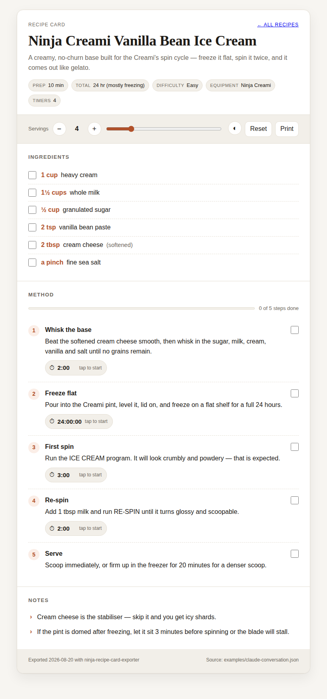
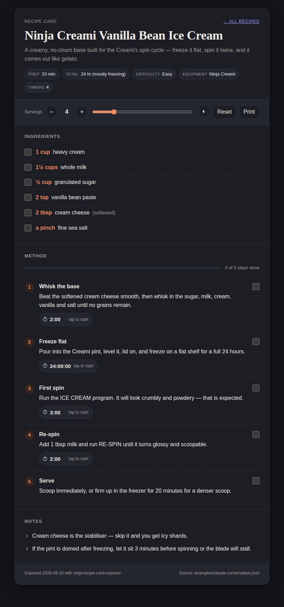
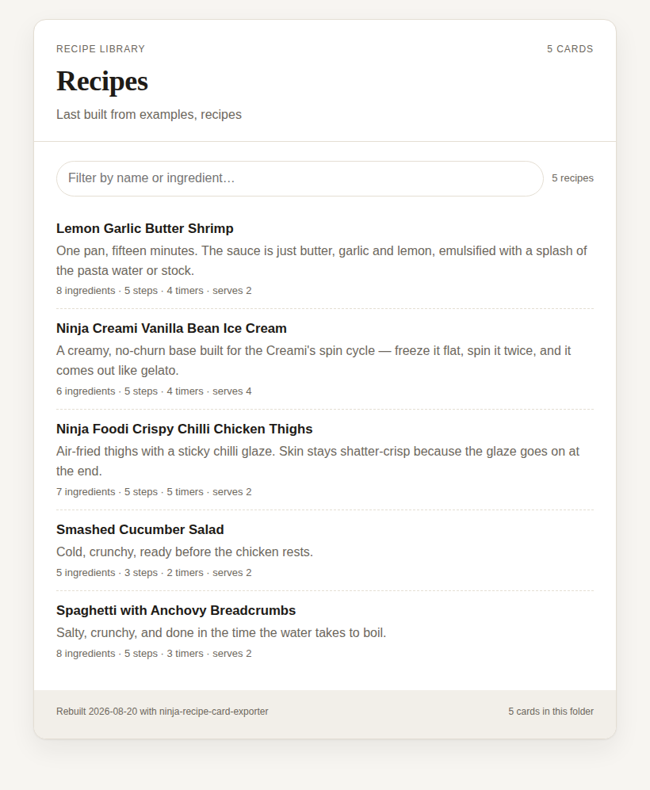

# Ninja Recipe Card Exporter

Pull recipe cards out of a Claude.ai conversation and turn each one into a
single, self-contained `.html` file that behaves like the card did in the chat:
drag the servings slider and every amount rescales, tick steps off as you go,
and tap a step's timer to start a countdown.

No frameworks, no CDN, no build step. One file per recipe — open it on a
laptop, AirDrop it to a phone, print it, or keep it in a folder on a NAS. It
works with the Wi-Fi off.

<p align="center">
  
  
</p>

## Install

Requires Node 18+ (Node 22 recommended). There are no runtime dependencies.

```bash
git clone https://github.com/monnas69/Recipes.git
cd Recipes
npm link          # optional — puts `ninja-recipes` on your PATH
```

Or run it straight from the checkout:

```bash
node bin/ninja-recipes.js <source> [options]
```

## Quick start

```bash
# Everything in a conversation export, into ./cards
ninja-recipes examples/claude-conversation.json -o cards

# See what would be exported, write nothing
ninja-recipes examples/claude-conversation.json --list

# One card straight to stdout
pbpaste | ninja-recipes - --stdout > weeknight-pasta.html

# Also produce PDFs
ninja-recipes chat-export.json -o cards --pdf
```

```
$ ninja-recipes examples/claude-conversation.json -o cards
Exported 3 recipe cards to /home/you/cards
  • Ninja Creami Vanilla Bean Ice Cream  (6 ingredients, 5 steps, 4 timers, serves 4, via fence:recipe-card)
  • Ninja Foodi Crispy Chilli Chicken Thighs  (7 ingredients, 5 steps, 5 timers, serves 2, via inline-json)
  • Smashed Cucumber Salad  (5 ingredients, 3 steps, 2 timers, serves 2, via markdown)
  ↳ index: cards/index.html
  (3 structured, 1 from markdown, 1 duplicate skipped)
```

## Input

| Source | How |
| --- | --- |
| Conversation export (`.json`) | Claude's data export, a single-conversation API response, or any JSON with a `chat_messages` / `messages` array |
| A folder | every supported file inside it (recursively) is scanned in one run |
| Several sources | `ninja-recipes chat1.md chat2.json -o cards` |
| Markdown or plain text (`.md`, `.txt`) | A pasted or exported transcript |
| Saved page (`.html`) | "Save page as" from the browser — inline JSON and visible text are both scanned |
| stdin | `ninja-recipes -` |
| Claude.ai URL | `ninja-recipes https://claude.ai/chat/<id> --cookie "sessionKey=..."` |

**About URLs:** Claude.ai conversations are private, so fetching one needs your
own session cookie — pass `--cookie` or set `CLAUDE_SESSION_KEY`. Without it the
site returns the app shell rather than the conversation, and the CLI says so
instead of writing an empty export. Exporting the chat to a file is the easier
path, and the one to reach for first.

## What counts as a recipe card

Cards are recognised four ways, in this order. The first three are structured
and exact; the fourth is a best-effort fallback for prose recipes.

1. **A tagged code fence** — ` ```recipe-card `, ` ```recipe `, or ` ```json `
2. **A tagged block** — `<recipe-card>{ ... }</recipe-card>`
3. **Bare JSON in prose** — any `{ ... }` carrying `ingredients` or `steps`,
   including artifact payloads inside the conversation JSON
4. **Markdown** — a heading followed by an *Ingredients* section and an
   *Instructions* / *Steps* / *Method* section (disable with
   `--no-markdown-fallback`)

The canonical card shape:

```json
{
  "title": "Ninja Creami Vanilla Bean Ice Cream",
  "description": "A creamy, no-churn base built for the Creami's spin cycle.",
  "base_servings": 4,
  "ingredients": [
    { "id": "cream", "name": "heavy cream", "amount": 1, "unit": "cup" },
    { "id": "salt", "name": "fine sea salt", "amount": "a pinch" }
  ],
  "steps": [
    { "title": "Whisk the base", "content": "Beat the cream cheese smooth…", "timer_seconds": 120 }
  ],
  "notes": ["Cream cheese is the stabiliser — skip it and you get icy shards."]
}
```

Common aliases are accepted, so cards written a little differently still land:
`name`/`recipe_name` for `title`; `servings`/`serves`/`portions` for
`base_servings`; `instructions`/`directions`/`method` for `steps`;
`quantity`/`qty` for `amount`; `tips`/`note` for `notes`; `timer`/`duration`
for `timer_seconds`. Ingredients and steps may also be plain strings —
`"1 1/2 cups all-purpose flour, sifted"` is parsed into amount, unit, name and
note, and `"Simmer for 12 minutes"` gets a 12-minute timer inferred from the
text.

Amounts understand whole numbers, decimals, fractions (`3/4`, `1 1/2`, `1½`)
and ranges (`2-3`, `1 to 2`). Anything unparseable (`a pinch`, `to taste`) is
kept verbatim and left out of scaling.

## What you get

Each card is one HTML file with everything inlined:

- **Servings slider** — `−` / `+` and a range control; every scalable amount
  rescales proportionally. Kitchen units snap to familiar fractions (`1½ cups`,
  `⅓ tsp`), weights stay decimal (`300 g`), and units agree with the number
  (`1 clove` → `3 cloves`).
- **Step checklist** — checkboxes with a progress bar.
- **Per-step countdown timers** — tap to start, tap again to pause, `reset` to
  clear. The tab title shows the soonest timer; finishing beeps (WebAudio),
  vibrates on phones that support it, and announces itself to screen readers.
- **Sticky state** — servings, ticked boxes and theme are remembered per recipe
  in `localStorage`, and the card still works when storage is blocked.
- **Dark mode** — follows the system by default, with a toggle for light/dark.
- **Print-friendly** — controls drop away, colours flatten, steps avoid page
  breaks. `--pdf` prints the same layout to a file.
- **schema.org `Recipe` JSON-LD** — embedded so other recipe apps can import it.
- **A self-rebuilding index** — every export writes `index.html`, built from
  *every* card in the output folder rather than just the run that wrote it. Add
  one chat to an existing library and the rest stay listed; delete a card file
  and it leaves the index on the next build. It carries a filter box that
  searches titles, descriptions and ingredients.

## Options

```
  -o, --out <dir>        output directory                 (default: recipe-cards)
  -f, --format <fmt>     auto | json | markdown | text | html   (default: auto)
      --pdf              also write a PDF per card
      --no-index         never write index.html
      --no-library       build index.html from this run only, ignoring cards
                         already in the output folder
      --site-title <t>   heading for index.html         (default: Recipe cards)
      --link <l>=<href>  add a link to index.html (repeatable)
      --json             also write recipes.json (the normalised data)
      --keep <mode>      all | latest — latest keeps only the newest card per title
      --title <text>     only export cards whose title contains <text>
      --no-markdown-fallback
                         only accept structured cards, never prose recipes
      --cookie <value>   Claude.ai session cookie for URL fetches
      --list             list what was found, write nothing
      --stdout           print the first card's HTML to stdout, write nothing
  -q, --quiet            only print errors
  -h, --help / -v, --version
```

`--keep latest` is the one worth remembering: when a conversation revised a
recipe several times, it keeps only the final version of each title.

## Publish to GitHub Pages

**Live: https://monnas69.github.io/Recipes/**

The repo ships with everything needed to serve your cards as a real website, so
the library is a tap away on a phone instead of a folder of files to download.

**One-time setup:** *Settings → Pages → Source: **GitHub Actions***. That's the
only click.

**After that, the loop is:**

```bash
cp ~/Desktop/chat.md recipes/2026-08-20-miso-salmon.md
git add recipes && git commit -m "Add miso salmon" && git push
```

`.github/workflows/pages.yml` runs the tests, rebuilds every card from
`recipes/` into `docs/`, and publishes it to
`https://<you>.github.io/<repo>/`. The index reappears with the new recipe in
it, sorted and searchable.

<p align="center">
  
</p>

`recipes/` holds your **sources** — the pasted chats. `docs/` holds the
**output** and is rebuilt from scratch each time, so edit a source and rebuild
rather than editing a card by hand. To preview before pushing:

```bash
npm run site && open docs/index.html
```

Prefer no Actions? Set *Pages → Source: Deploy from a branch → main → /docs*
instead, run `npm run site` yourself, and commit the `docs/` folder.

### PDF export

`--pdf` needs a headless browser, and finds one two ways:

1. `puppeteer` or `puppeteer-core`, if installed (`npm i puppeteer`)
2. any local Chrome/Chromium — checked on the usual paths, or set `CHROME_PATH`

Neither is a dependency. Without one, `--pdf` fails with a message saying so
and the HTML export is unaffected.

## Library use

```js
import { collectRecipes, exportRecipes, renderCard } from 'ninja-recipe-card-exporter';

const { recipes } = await collectRecipes('chat-export.json');
const html = renderCard(recipes[0], { sourceLabel: 'my kitchen chat' });

await exportRecipes('chat-export.json', { outDir: 'cards', pdf: true, keep: 'latest' });
```

Also exported: `extractRecipes`, `parseMarkdownRecipes`, `findStructuredCards`,
`normalizeRecipe`, `renderIndex`, `loadSource`, `fetchConversation`,
`htmlFileToPdf`, and the amount helpers (`parseAmount`, `formatAmount`,
`scaledAmountWithUnit`, `formatClock`).

## Meal planner

The site also builds a weekly meal planner at `docs/planner.html`, linked from
the index. Assign recipes to days, adjust servings per meal, and it aggregates a
de-duplicated shopping list from everything planned that week. A day can also
hold a meal that is just a name — "leftovers", "bangers and mash" — for the
things you cook without a card; those add nothing to the shopping list, and the
list says so rather than leaving a silent gap.

```bash
npm run planner                     # rebuild docs/planner.html
npm run planner shopping 2026-W36   # print a week's list, no browser needed
```

Plans are JSON files committed under `planner/data/plans/`, one per ISO week —
shared between people by git, like the recipes. There is no server and no
account. Full documentation, including the shopping-list merging rules, is in
[`planner/README.md`](planner/README.md).

## Layout

```
recipes/               your pasted chats (the sources for the site)
docs/                  the built site: index.html + one file per card
bin/ninja-recipes.js   CLI entry point
src/cli.js             argument parsing, output messages
src/transcript.js      input loading: URL, JSON, HTML, Markdown, stdin
src/parse.js           card extraction (fences, tags, inline JSON, Markdown)
src/normalize.js       alias handling → one canonical recipe shape
src/render.js          canonical recipe → self-contained HTML
src/export.js          pipeline: load → extract → render → write
src/library.js         reads existing cards back out of the output folder
src/pdf.js             optional PDF backends
src/shared/            inlined into every card: format.js, card.css, card-client.js
planner/               the meal planner (see planner/README.md)
planner/data/plans/    one committed JSON file per planned week
```

`src/shared/format.js` is imported by the CLI *and* inlined into every exported
card, so the amounts a card shows in the browser are computed by exactly the
same code the CLI tests cover.

## Tests

```bash
npm test
```

120 tests: quantity parsing, scaling and unit agreement, card extraction from
every supported shape, HTML rendering (escaping, no external references,
embedded data), library rebuilds (carry-over, deletion, re-export), the CLI end
to end, ISO week maths across year boundaries, shopping-list aggregation, plan
validation, and two real-browser passes — one driving a card's slider,
checkboxes, timers, theme toggle and print styles, one planning a week in the
planner and checking the shopping list it produces. The browser tests skip
themselves unless Playwright is installed:

```bash
npm i -D playwright && npx playwright install chromium
```

## Limitations

- Fetching a conversation by URL needs your session cookie; exported files are
  the reliable path.
- The Markdown fallback wants an *Ingredients* heading and an *Instructions*
  (or *Steps* / *Method*) heading. Prose recipes without headings are skipped
  rather than guessed at.
- Inferred timers read the longer end of a range: "rest 10–15 minutes" becomes
  15 minutes.

## License

MIT
